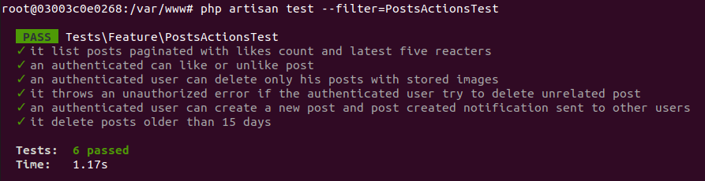

## Millions backend challenge
My own implementation of the backend challenge. 

## Implemented features
* [x] Show posts paginated, and ordered by creation date with their information (Image, description, date, author) including
  total likes and the last 5 usernames who liked the post.
* [x] A user can register and login.
* [x] An authenticated user can create a new post
* [x] An authenticated user can remove his posts, with the image file
* [x] An authenticated user can like/unlike other posts.
* [x] An authenticated user can see all likes of a specific post.
* [x] Send a notification to other users when a new post is added using (Database channel)
* [x] Automatically delete posts 15 days old.
* [x] [BONUS] Created 6 feature tests including success & failure scenarios



## Used technologies

- PHP 7.4
- Laravel 8
- PHPUnit
- Redis (for queue)
- Tymon/jwt-auth package (for authentication)
- Docker

## Installation & testing

To get the project up and running on your local machine, do the following. I assume you already know how to go about laravel, composer, so I'll be brief

- clone it => git clone https://github.com/MouadZIANI/millions-backend-challenge or download it
- Run composer install, to install dependencies
- Edit the created ``.env`` file at the root of your project, to add database credentials, etc
- For create the tables of database run this command ``php artisan migrate`` in your cmd
- You can also run ``` php artisan db:seed ``` in order to fill you database with a random fake data
- Then run ``` php artisan serve ```

Nb: In this project I used redis to store the queued notifications, so you have to configure it locally then run this command ``php artisan queue:work`` to run dispatched notifications.

## Testing
In this file [doc/postman_collection.json](doc/postman_collection.json) you will find the postman collection that you can import into your local postman app and test the api.


